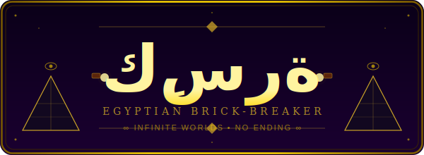

<p align="center">
  
</p>

<p align="center">
  <b>9 Cycling Worlds • Infinite Rounds • 50+ Power-ups • Recurring Bosses • ∞ No Ending</b>
</p>

<p align="center">
  <i>"محصلتش قبل كده ولا هتحصل"</i>
</p>

<p align="center">
  <a href="https://github.com/Lord1Egypt/Kesra/releases"></a>
  
  
  
</p>

---

## 🌟 Overview

**كِسرة (Kesra)** is an infinite Egyptian brick-breaker — a journey through 9 knowledge worlds
of Egyptian civilization that loops forever, getting harder and richer every cycle.

Built with **Python + Pygame**, combining classic **Arkanoid/Breakout** gameplay with:
- Procedural infinite rounds — no level cap, no ending
- Beautiful particle effects and glowing visuals
- Egyptian-themed worlds cycling from Science to Space

| # | World | Theme | Recurring Boss |
|---|-------|-------|----------------|
| 🧪 | **Scientific** | Astronomy, Math, Medicine | Imhotep |
| 🎨 | **Artistic** | Hieroglyphics, Sculpture, Music | Thoth |
| 📜 | **Historical** | Kingdoms, Conquests, Revolutions | Ramesses II |
| 🌍 | **Geographical** | Nile, Deserts, Red Sea | Hapi |
| 🏛️ | **Architectural** | Pyramids, Temples, Mosques | Seshat |
| ☀️ | **Religious** | Mythology, Monotheism, Mysticism | Ra |
| 🇪🇬 | **National** | Flag, Army, Suez Canal | Nebty |
| 📦 | **Logistical** | Quarrying, Transport, Trade | Khufu |
| 🚀 | **Space & Rockets** | Satellite, Mars, NARSS | NARSS Director |

Biomes **cycle forever** — after World 9 it loops back to World 1, harder and with rarer drops.
There is no final world and no ending.

---

## 🎮 Features

### 🕹️ Gameplay
- **♾️ Infinite by design** — no level cap, no ending
- **Classic brick-breaking** with physics that feel crisp and satisfying
- **Combo system** — chain hits for massive score multipliers and special effects
- **9 recurring boss rounds** — bosses come back stronger every cycle
- **50+ power-up drops**: wide paddle, fireball, magnet, shield, multi-ball and more
- **6 brick tiers**: mud → stone → marble → granite → gold → obsidian

### 🎨 Visual Effects
- **Glowing ball** with color trail and pulse animation
- **Particle explosions** on every brick break, colored by brick type
- **3D-styled bricks** with highlight, shadow, and crack animation on hit
- **Animated starfield background** with biome-colored atmosphere
- **Screen shake** on combo hits
- **Score popups** that rise and fade

### 🎯 Progression
- Score and combo system
- Difficulty scales every round — more bricks, tougher types, rarer drops
- Boss rounds every 8th round of a cycle

---

## 📱 Platforms

| Platform | Status |
|----------|--------|
| 🌐 **Web (Browser)** | 🟡 In progress — via Pygbag (Python→WASM) |
| 🖥️ **Windows** | ✅ Runs from source — `pip install pygame-ce && python main.py` |
| 🐧 **Linux / macOS** | ✅ Runs from source |
| 🤖 **Android / iOS** | 🔄 Planned |

---

## 🚀 Quick Start

### Run Locally

```bash
git clone https://github.com/Lord1Egypt/Kesra.git
cd Kesra

pip install pygame-ce
python main.py
```

### Controls

| Action | Key |
|--------|-----|
| Move paddle | ← → Arrow keys or A / D |
| Launch ball | Space |
| Pause | Escape |

### Download a Release
Go to **[Releases](https://github.com/Lord1Egypt/Kesra/releases)** and grab the latest build.

---

## 🏗️ Architecture

```
Kesra/
├── main.py              # Entry point (async — Pygbag web-compatible)
├── settings.py          # Constants (screen, speeds, colours, biomes)
├── gfx.py               # Drawing primitives (glow, gradients, 3D bricks)
├── particles.py         # Particle system
├── levelgen.py          # Procedural infinite level generator
├── entities.py          # Ball, Paddle, Brick, Drop
├── scenes.py            # Menu, Play, GameOver scene classes
├── state.py             # GameState singleton (score, lives, round, combo)
├── assets/ui/           # Logo and UI graphics
├── ROADMAP.md           # Live phase checklist ← check here for status
├── GAME_DESIGN.md       # World/boss/power-up design spec
└── CLAUDE.md            # Engineering memory for AI assistants
```

---

## 🗺️ Roadmap

See [ROADMAP.md](ROADMAP.md) for the full live checklist. Summary:

| Phase | Milestone | Status |
|-------|-----------|--------|
| 🏗️ v0.1 | Infinite core (Godot prototype) | ✅ Released |
| 🐍 v0.2 | Python + Pygame rewrite — beautiful graphics | 🟡 In progress |
| 🌐 v0.3 | Pygbag web export — play in browser | 🔴 Planned |
| 🎨 v0.4 | Full power-up / boss / particle pass | 🔴 Planned |
| 🏆 v0.5 | Shop, achievements, save system | 🔴 Planned |
| 📱 v0.6 | Android + iOS | 🔴 Planned |
| ♾️ Seasons | Ongoing content forever | 🔴 Ongoing |

---

## 📜 License

**Kesra** is open-source under the **MIT License**.

Built with ❤️ by **Mohamed (Lord1Egypt)** 🇪🇬

---

